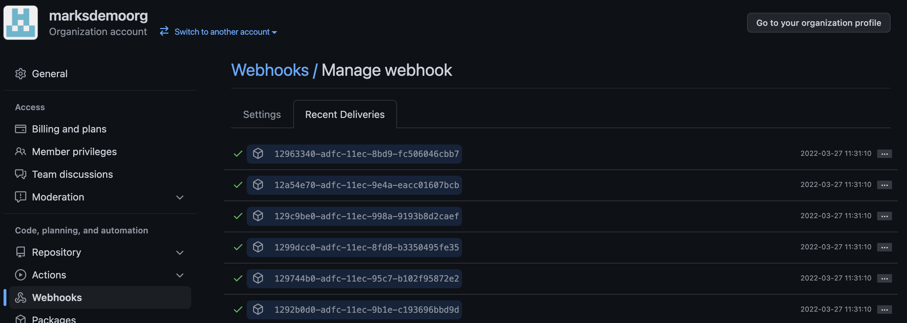

# Running and testing the Security Logging API

The follow are required to test this application

Docker desktop - https://www.docker.com/get-started/

Ngrok - https://dashboard.ngrok.com/get-started/setup

## Explanation of the Security Logging API

The marksdemoorg Github organization has been setup with starter workflows which can be leveraged in repositories within marksdemoorg. The starter workflows make it easier to build, test, and code scan when changes occur in a repository. The mh.github.user.service repository has a workflow setup to leverage these starter workflows for push, pull, and workflow dispatch actions. 

Additionally, marksdemoorg has a webhook setup to POST code scanning alerts to a configured URL whenever code scan issues are detected. The Security Logging API (mh.github.security) application will receive the POST requests from the webhook and logs the data to a local data repository.

There is a second API handler in the Security Logging API that will receive POST requests from an organization webhook when repositories are added. This would be leveraged to set security options on the new repo as well as creating an issue stating the change. Given more time, this API would write to a message queue that be picked up by a backround processor that to call the Github API to enable security features and write and issue to the repo. There are additional comments in the code on this.

## Steps to test the API
1 Clone the code from the Github repository

    git clone https://github.com/marksdemoorg/mh.github.security.git

2 From the root directory of the repository on your local machine, open a
terminal window and run the following to build the docker containers.

    docker-compose build

3 Once complete run the following command to start the containers.
    
    docker-compose up

4 Open Docker desktop and check which port the mhgithubsecurity container is running on.
In this instance it's port 49558

5 In a new terminal screen we will use Ngrok to expose our service externally so that Github 
webhooks can POST to it.

Run the following command, replacing the port number with the port number observed in step 4.

    ngrok http https://localhost:49558 -host-header="localhost:49558"

6 Once Ngrok is running, copy the https Forwarding URL displayed on the screen. In this instance it is 
https://4525-24-18-16-110.ngrok.io

7 Open the organization webhooks and select Edit for the Code Scanning alert webhook.
https://github.com/organizations/marksdemoorg/settings/hooks

8 Update the Payload URL based on the Ngrok address and press Update Webhook at the bottom of the page.

9 Open the sample project application in Github
https://github.com/marksdemoorg/mh.github.user.service

10 Browse the code files and edit one of the .cs files. Add an unused variable similar to:

    var myUnusedVar = "Hello";
    
And commit the changes

11 Go to the build workflow and wait for its completion
https://github.com/marksdemoorg/mh.github.user.service/actions/workflows/CI-Workflow.yml

12 Open the webhooks recent deliveries tab
https://github.com/organizations/marksdemoorg/settings/hooks/349975437?tab=deliveries

Look for a delivery for the code issue in the push and select one of the recent deliveries. 

In this case, Delivery ID 12963340-adfc-11ec-8bd9-fc506046cbb7

There should be a green check mark indicating the delivery we successful. If there is a red caution icon, this means the delivery failed. You can select the delivery to see the detail of the failure to troubleshoot and resend.

13 Using the Ngrok URL, open the service app Swagger page using the URL below

[Ngrok URL]/swagger/index.html

14 Select the GET API and press the Try it out button.

For the key parameter enter the unique id from step 12, in this case 12963340-adfc-11ec-8bd9-fc506046cbb7

Press Execute

15 Examine the results of the Response body to verify the POST was successful and the results have been retained.

